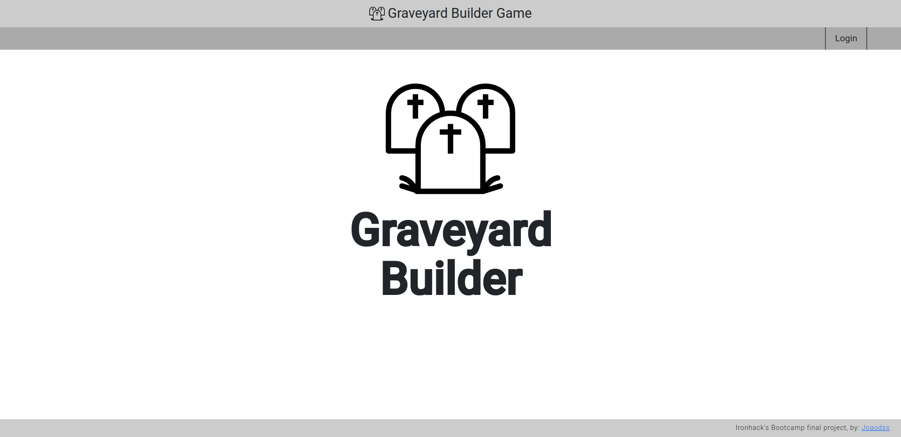
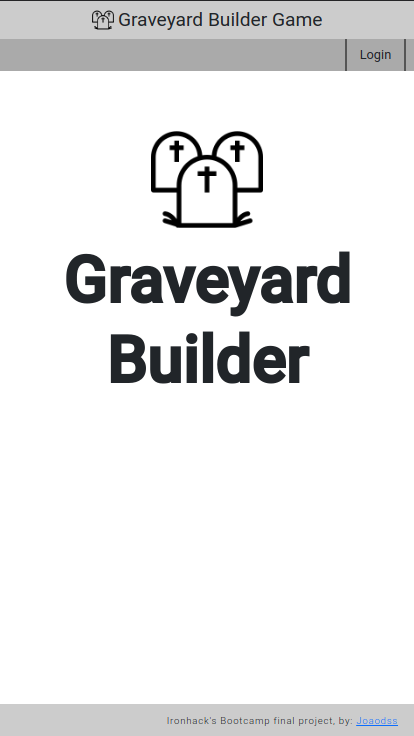
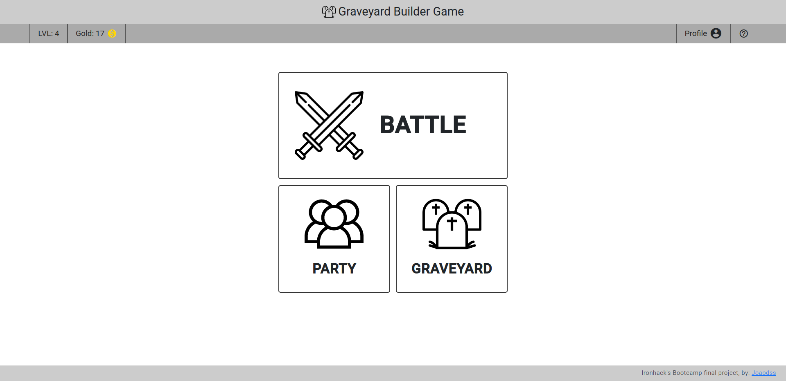
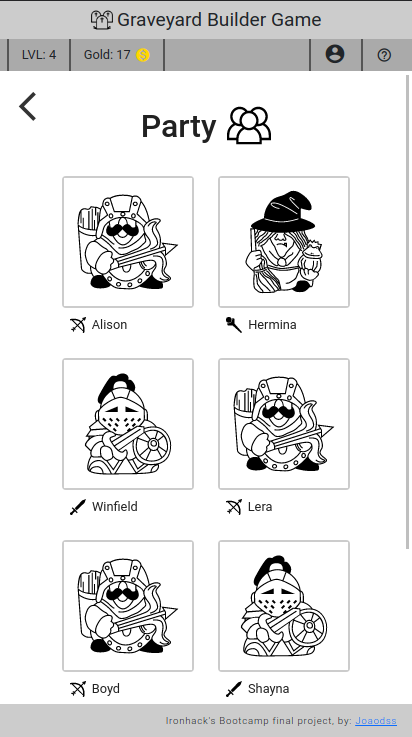
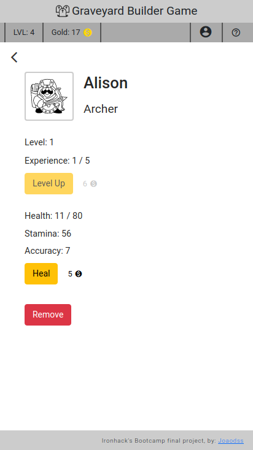
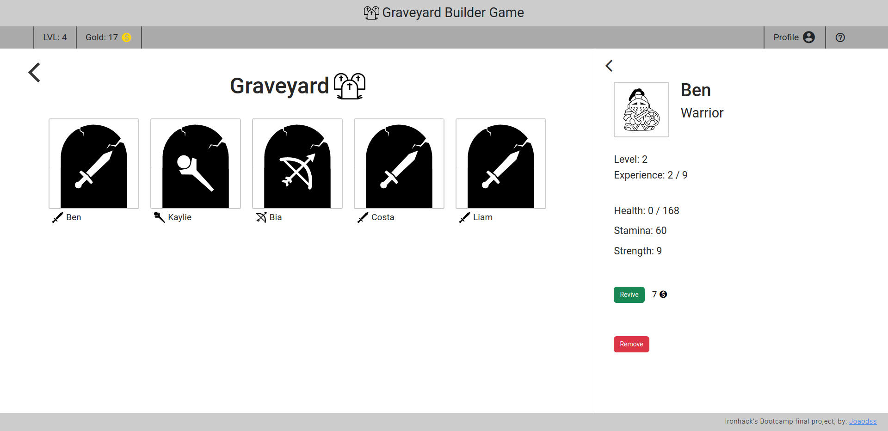
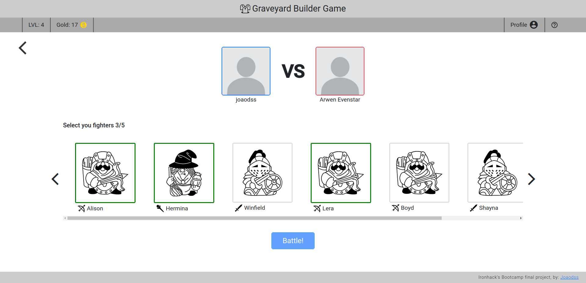
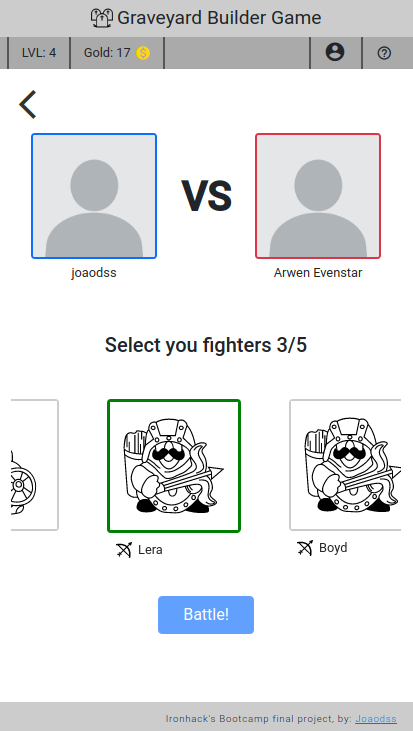
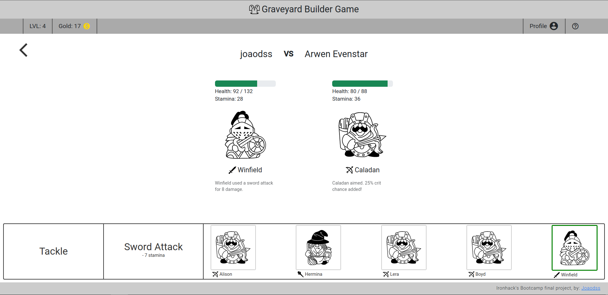
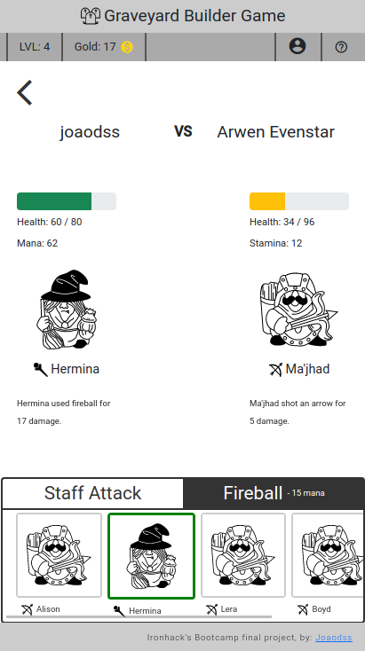

# Graveyard Builder Game

The final project for Ironhack Web Dev Bootcamp.

## Summary

## Table Of Contents

- [Graveyard Builder Game](#graveyard-builder-game)
  - [Summary](#summary)
  - [Table Of Contents](#table-of-contents)
  - [About The Project](#about-the-project)
    - [Project Requirements](#project-requirements)
    - [The game](#the-game)
    - [Built With](#built-with)
  - [Getting Started](#getting-started)
    - [Setup - Frontend Application](#setup---frontend-application)
    - [Setup - Backend Microservices](#setup---backend-microservices)
  - [Frontend Application](#frontend-application)
  - [Backend API](#backend-api)
    - [Security](#security)
    - [Routes](#routes)
    - [Payloads](#payloads)
  - [Project Diagrams](#project-diagrams)
  - [Road Map](#road-map)
  - [Contacts](#contacts)

## About The Project

This project was created as the final project for the Ironhack Web Dev Bootcamp. It's a web application game based on one of my first java group projects and inspired by games like pokemon and RPG games with some roguelike elements.

The project is divided into multiple microservices and a client application:

- [Graveyard-Builder-Game-Client](https://github.com/Joaodss/Graveyard-Builder-Game-Client)
- [Graveyard-Builder-Game-Discovery-Service](https://github.com/Joaodss/Graveyard-Builder-Game-Discovery-Service)
- [Graveyard-Builder-Game-Gateway-Service](https://github.com/Joaodss/Graveyard-Builder-Game-Gateway-Service)
- [Graveyard-Builder-Game-User-Model-Service](https://github.com/Joaodss/Graveyard-Builder-Game-User-Model-Service)
- [Graveyard-Builder-Game-Character-Model-Service](https://github.com/Joaodss/Graveyard-Builder-Game-Character-Model-Service)
- [Graveyard-Builder-Game-Opponent-Selection-Service](https://github.com/Joaodss/Graveyard-Builder-Game-Opponent-Selection-Service)
- [Graveyard-Builder-Game-Battle-Service](https://github.com/Joaodss/Graveyard-Builder-Game-Battle-Service)
- [Graveyard-Builder-Game-Party-Manager-Service](https://github.com/Joaodss/Graveyard-Builder-Game-Party-Manager-Service)
- [Graveyard-Builder-Game-Profile-Service](https://github.com/Joaodss/Graveyard-Builder-Game-Profile-Service)
- [Graveyard-Builder-Game-SignIn-Service](https://github.com/Joaodss/Graveyard-Builder-Game-SignIn-Service)
- [Graveyard-Builder-Game-Auth-Service](https://github.com/Joaodss/Graveyard-Builder-Game-Auth-Service)

### Project Requirements

Your project must meet all of the requirements below:

- Include a microservices Java/Spring Boot backend and an Angular frontend.
- Include at least 2 SQL database tables.
- Include at least 4 services plus at least 1 edge service.
- Include at least 1 GET, POST, PUT/PATCH, and DELETE route.
- Include adequate and complete documentation.

### The game

Graveyard Builder Game consists of a single-player browser game. The players must build their party of warriors, archers, and mages, defeat other players, gain gold, and level up. Each character type has its unique stats and abilities. When characters die, they will be moved to the graveyard. To add them back to the party, the player must revive them with gold.

**The game is temporarily available at <http://graveyardbuildergame.site>**

#### Features

- 3 classes of characters: Warrior, Archer, Mage
- Automatic opponent generation
- Random option on character creation
- Customizable characters and user pictures
- Battle other players' teams
- Help page
- Mobile-friendly interface
- JWT authentication

### Built With

Technologies used in this project:

- [Java](https://www.java.com/)
- [Spring](https://spring.io/)
- [MySQL](https://www.mysql.com/)
- [Node.js](https://nodejs.org/en/)
- [Angular](https://angular.io/)
- [PostMan](https://www.getpostman.com/)
- [GitHub](https://github.com/)
- [Linode](https://www.linode.com/)
- [LucidChart](https://www.lucidchart.com/)

## Getting Started

The project contains separate microservices for the backend and a client frontend part. To locally run the web application all parts must be operational.

### Setup - Frontend Application

- Clone the frontend repository: <https://github.com/Joaodss/Graveyard-Builder-Game-Client>
- Install the dependencies: `npm i`
- Run the following command to start the frontend application: `npm start`
- The application will be available at [http://localhost:4200/](http://localhost:4200/)

### Setup - Backend Microservices

- Clone the backend repositories:

  - <https://github.com/Joaodss/Graveyard-Builder-Game-Discovery-Service>
  - <https://github.com/Joaodss/Graveyard-Builder-Game-Gateway-Service>
  - <https://github.com/Joaodss/Graveyard-Builder-Game-User-Model-Service>
  - <https://github.com/Joaodss/Graveyard-Builder-Game-Character-Model-Service>
  - <https://github.com/Joaodss/Graveyard-Builder-Game-Opponent-Selection-Service>
  - <https://github.com/Joaodss/Graveyard-Builder-Game-Battle-Service>
  - <https://github.com/Joaodss/Graveyard-Builder-Game-Party-Manager-Service>
  - <https://github.com/Joaodss/Graveyard-Builder-Game-Profile-Service>
  - <https://github.com/Joaodss/Graveyard-Builder-Game-SignIn-Service>
  - <https://github.com/Joaodss/Graveyard-Builder-Game-Auth-Service>
  - <https://github.com/EN-IH-WDPT-JUN21/CSharks-BackEndHomework>

- Setup the following database name and user, or set up your database by changing the values in the `application.properties` file

```sql
CREATE DATABASE GraveyardBuilder;

CREATE USER 'ironhacker'@'localhost' IDENTIFIED BY '1r0n-H4ck3r';
GRANT ALL PRIVILEGES ON GraveyardBuilder.* TO 'ironhacker'@'localhost';
FLUSH PRIVILEGES;
```

- Run the following command to start each spring application: `mvn spring-boot:run`, or by using an IDE like IntelliJ IDEA
- The application will be available by using the gateway service at [http://localhost:8000/](http://localhost:8000/)

## Frontend Application

|               Home page                |                Home page mobile                 |
| :------------------------------------: | :---------------------------------------------: |
|  |  |

|             Menu page              |              Menu page mobile               |
| :--------------------------------: | :-----------------------------------------: |
|  |  |

|              Party page              |             Party page mobile grid              | Party page mobile details                       |
| :----------------------------------: | :---------------------------------------------: | ----------------------------------------------- |
|  |  |  |

|             Graveyard page              |               Graveyard page mobile               |
| :-------------------------------------: | :-----------------------------------------------: |
|  |  |

|         Battle selection page         |          Battle selection page mobile          |
| :-----------------------------------: | :--------------------------------------------: |
|  |  |

|              Battle page              |               Battle page mobile               |
| :-----------------------------------: | :--------------------------------------------: |
|  |  |

## Backend API

### Security

There is an admin pre-generated profile that can be used for managing the users and fixing possible user problems.

**Admin:**

```javascript
username: admin;
password: ironhack - admin;
```

This project implements a [JWT](https://jwt.io/) authentication mechanism. The JWT is generated by the backend and sent to the frontend. The frontend uses the JWT to authenticate the user and retrieve information.

To authenticate the user/admin manually (with Postman or another tool) you must follow these steps:

- To log in with the pretended profile send a post request to the login page: [http://localhost:8000/login](http://localhost:8000/login);
- In the body of the request add the `x-www-form-urlencoded` format and add the following values:
  | key | value |
  | ---------- | ----------------- |
  | `username` | `<username here>` |
  | `password` | `<password here>` |

- The response will contain a JWT token and an expiration date.
- To access the protected routes you must add the JWT token to the `Authorization` header of the request with the following format:
  | key | value |
  | --------------- | --------------------- |
  | `Authorization` | `Bearer <token here>` |

### Routes

All routes available are managed by the Gateway Service on port 8000. For more information on the specific microservices routes, please refer to the documentation of the microservice.

#### Public Access

SignIn service:

| Route Type | Route                            | Description                                                                                                   |
| :--------: | -------------------------------- | ------------------------------------------------------------------------------------------------------------- |
|    POST    | /api/v1/signIn/validate/username | Registers a new user, returns [**UserDTO**](#userdto). Requires body: [**RegisterUserDTO**](#registeruserdto) |
|    POST    | /api/v1/signIn/validate/email    | Checks if username is valid (does not exist), returns boolean. Requires body: [**UsernameDTO**](#usernamedto) |
|    POST    | /api/v1/signIn/register          | Checks if email is valid (does not exist), returns boolean. Requires body: [**EmailDTO**](#emaildto)          |

Auth service:

| Route Type | Route  | Description                                                   |
| :--------: | ------ | ------------------------------------------------------------- |
|    POST    | /login | User login. Check [Security](#security) for more information. |

#### Registered User Access

Profile service:

| Route Type | Route                            | Description                                                                                                              |
| :--------: | -------------------------------- | ------------------------------------------------------------------------------------------------------------------------ |
|    GET     | /api/v1/profiles/user            | Returns [**UserDTO**](#userdto) of authenticated user.                                                                   |
|    GET     | /api/v1/profiles/experience      | Returns [**ExperienceDTO**](#experiencedto) of authenticated user.                                                       |
|    GET     | /api/v1/profiles/gold            | Returns [**GoldDTO**](#golddto) of authenticated user.                                                                   |
|    POST    | /api/v1/profiles/update/all      | Updates user information of authenticated user, returns [**UserDTO**](#userdto). Requires body: [**UserDTO**](#userdto). |
|    POST    | /api/v1/profiles/update/password | Updates user password of authenticated user. Requires body: [**PasswordChangeDTO**](#passwordchangedto).                 |

Party Manager service:

| Route Type | Route                               | Description                                                                                                                                                 |
| :--------: | ----------------------------------- | ----------------------------------------------------------------------------------------------------------------------------------------------------------- |
|    GET     | /api/v1/party-manager/party         | Returns party ([**CharacterDTO[]**](#characterdto)) of authenticated user.                                                                                  |
|    GET     | /api/v1/party-manager/graveyard     | Returns graveyard ([**CharacterDTO[]**](#characterdto)) of authenticated user.                                                                              |
|    GET     | /api/v1/party-manager/id/{{id}}     | Returns [**CharacterDTO**](#characterdto) of authenticated user by character id. Requires id: long.                                                         |
|    POST    | /api/v1/party-manager/create        | Creates new character for authenticated user, returns [**CharacterDTO**](#characterdto). Requires body: [**NewCharacterDTO**](#newcharacterdto).            |
|    PUT     | /api/v1/party-manager/level-up      | Levels up a character, returns [**CharacterDTO**](#characterdto). Requires body: [**LevelUpDTO**](#levelupdto).                                             |
|    PUT     | /api/v1/party-manager/heal/{{id}}   | Heals a character of authenticated user by character id, returns [**CharacterDTO**](#characterdto). Requires id: long. Request parameters: healAmount: int. |
|    PUT     | /api/v1/party-manager/revive/{{id}} | Revives a character of authenticated user by character id, returns [**CharacterDTO**](#characterdto). Requires id: long.                                    |
|   DELETE   | /api/v1/party-manager/delete/{{id}} | Deletes a character of authenticated user by character id. Requires id: long.                                                                               |

Battle service:

| Route Type | Route                                   | Description                                                                                                                                               |
| :--------: | --------------------------------------- | --------------------------------------------------------------------------------------------------------------------------------------------------------- |
|    GET     | /api/v1/battle/opponents                | Retrieves an opponent team to battle, returns [**OpponentDTO**](#opponentdto).                                                                            |
|    PUT     | /api/v1/battle/updateHealth/{{id}}      | Update character health by id, returns [**CharacterDTO**](#characterdto). Requires id: long. Request parameters: health: int.                             |
|    PUT     | /api/v1/battle/addExperience/{{id}}     | Add experience to character by id, returns [**CharacterDTO**](#characterdto). Requires id: long. Request parameters: experience: long.                    |
|    PUT     | /api/v1/battle/addUserExperienceAndGold | Add experience and gold to the authenticated user, returns [**UserDTO**](#userdto). Request parameters: experience(optional): long, gold(optional): long. |

#### Admin Access

User Model service:

| Route Type | Route                                      | Description                                                                                                                               |
| :--------: | ------------------------------------------ | ----------------------------------------------------------------------------------------------------------------------------------------- |
|    GET     | /api/v1/users/all                          | Returns all users' details [**UserDTO**](#userdto).                                                                                       |
|    GET     | /api/v1/users/id/{{id}}                    | Returns [**UserDTO**](#userdto) by id. Requires id: long.                                                                                 |
|    GET     | /api/v1/users/auth/{{username}}            | Returns [**UserAuthDTO**](#userauthdto) by username. Requires username: string.                                                           |
|    GET     | /api/v1/users/username/{{username}}        | Returns [**UserDTO**](#userdto) by username. Requires username: string.                                                                   |
|    GET     | /api/v1/users/email/{{email}}              | Returns [**UserDTO**](#userdto) by email. Requires email: string.                                                                         |
|    GET     | /api/v1/users/partyLevel                   | Returns list of usernames between min and max party level. Request parameters: min(optional): int, max(optional): int.                    |
|    POST    | /api/v1/users/register                     | Registers new user, returns [**UserDTO**](#userdto). Requires body: [**RegisterUserDTO**](#registeruserdto).                              |
|    PUT     | /api/v1/users/update/{{username}}          | Updates user information by username, returns [**UserDTO**](#userdto). Requires username: string. Requires body: [**UserDTO**](#userdto). |
|    PUT     | /api/v1/users/update/{{username}}/password | Updates user password by username. Requires username: string. Requires body: [**NewPasswordDTO**](#newpassworddto) .                      |
|   DELETE   | /api/v1/users/delete/{{username}}          | Deletes user by username. Requires username: string.                                                                                      |

Character Model service:

| Route Type | Route                                     | Description                                                                                                                   |
| :--------: | ----------------------------------------- | ----------------------------------------------------------------------------------------------------------------------------- |
|    GET     | /api/v1/characters/all                    | Return all characters ([**CharacterDTO[]**](#characterdto)).                                                                  |
|    GET     | /api/v1/characters/id/{{id}}              | Return character by id. Requires id: long.                                                                                    |
|    GET     | /api/v1/characters/party/{{username}}     | Return party ([**CharacterDTO[]**](#characterdto)) by user username. Requires username: string.                               |
|    GET     | /api/v1/characters/graveyard/{{username}} | Return graveyard ([**CharacterDTO[]**](#characterdto)) by user username. Requires username: string.                           |
|    POST    | /api/v1/characters/create                 | Creates new character, returns [**CharacterDTO**](#characterdto). Requires body: [**NewCharacterDTO**](#newcharacterdto).     |
|    PUT     | /api/v1/characters/update                 | Updates a character information, returns [**CharacterDTO**](#characterdto). Requires body: [**CharacterDTO**](#characterdto). |
|    PUT     | /api/v1/characters/update/levelUp         | Levels up a character, returns [**CharacterDTO**](#characterdto). Requires body: [**LevelUpDTO**](#levelupdto).               |
|   DELETE   | /api/v1/characters/delete/{{id}}          | Deletes a character by id. Requires id: long.                                                                                 |

Opponent Selection service:

| Route Type | Route                           | Description                                                                                                                    |
| :--------: | ------------------------------- | ------------------------------------------------------------------------------------------------------------------------------ |
|    GET     | /api/v1/opponent/random/{level} | Retrieves an opponent team of a given level, returns [**CharacterDTO[]**](#characterdto). Request parameters: partyLevel: int. |

### Payloads

#### RegisterUserDTO

```javascript
{
  "username": string,
  "email": string,
  "password": string
}
```

#### UsernameDTO

```javascript
{
  "username": string,
}
```

#### EmailDTO

```javascript
{
  "email": string,
}
```

#### UserDTO

```javascript
{
  "username": string,
  "email": string,
  "roles": string[],
  "profilePictureUrl": string,
  "experience": long,
  "gold": long,
  "partyLevel": int
}
```

#### UserAuthDTO

```javascript
{
  "username": string,
  "password": string,
  "roles": string[]
}
```

#### ExperienceDTO

```javascript
{
  "experience": long,
}
```

#### GoldDTO

```javascript
{
  "gold": long,
}
```

#### PasswordChangeDTO

```javascript
{
  "oldPassword": string,
  "newPassword": string
}
```

#### NewPasswordDTO

```javascript
{
  "newPassword": string
}
```

#### NewCharacterDTO

```javascript
{
  "userUsername": string,
  "type": string,
  "name": string,
  "pictureURL": string
}
```

#### CharacterDTO

```javascript
{
  "id": long,
  "userUsername": string,
  "type": string,
  "isAlive": boolean,
  "deathTime": string,
  "name": string,
  "pictureURL": string,
  "level": int,
  "experience": long,
  "maxHealth": int,
  "currentHealth": int,
  "passiveChance": double,
  "maxStamina": int,
  "currentStamina": int,
  "strength": int,
  "accuracy": int,
  "maxMana": int,
  "currentMana": int,
  "intelligence": int
}
```

#### LevelUpDTO

```javascript
{
  "id": long,
  "healthPoints": int,
  "energyPoints": int,
  "attackPoints": int
}
```

#### OpponentDTO

```javascript
{
  "username": string,
  "profilePictureUrl": string,
  "opponents": CharacterDTO[]
}
```

## Project Diagrams


## Road Map

- Complete backend testing;
- Refactor JWT security in microservices;
- Optimize opponent AI actions;
- Animate battle;
- Enhance design;
- Deploy to AWS;
- Add Facebook login and friends integration;
- Online P2P battles

## Contacts

- João Afonso Silva - [GitHub](https://github.com/Joaodss)
